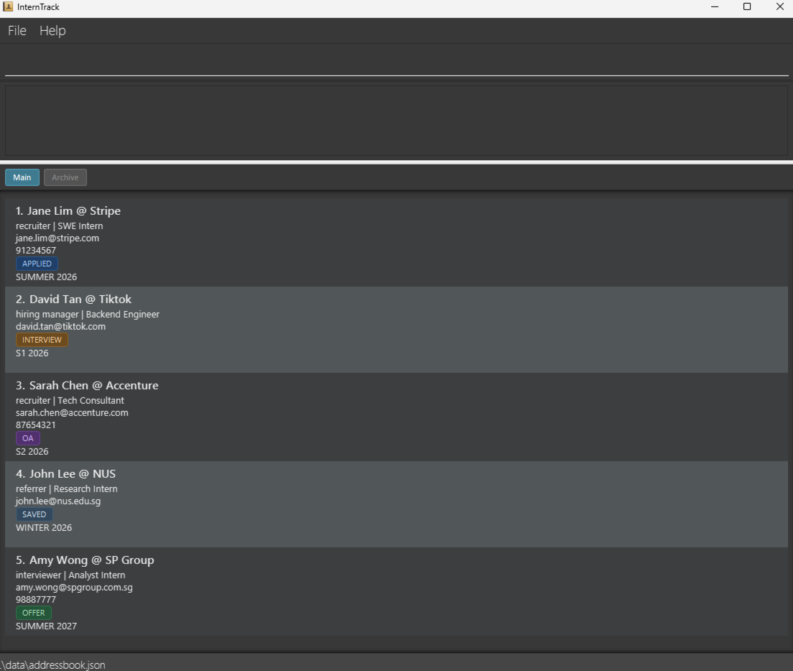

# InternTrack

InternTrack is a lightweight desktop app for **managing application-related contacts**, optimized for fast keyboard input while still providing the benefits of a graphical interface.

It is designed for tech-savvy undergraduates in Singapore who are applying to multiple internships and need a quick way to capture, update, and retrieve contacts such as recruiters, interviewers, referrers, and company points of contact, together with the relevant opportunity context linked to each contact.

InternTrack helps users reduce fragmented information, missed follow-ups, and mental overhead by keeping important contact records in one offline desktop tool.

## Features
1. **Add opportunity contact** — Create a new application-related contact record.
2. **Remove opportunity contact** — Delete a tracked contact record that is no longer needed.
3. **List opportunity contacts** — View all tracked contact records in the current workspace.
4. **Edit opportunity record** — Update an existing contact record when details or opportunity context change.
5. **Find active or archived records by keyword** — Quickly retrieve matching records when needed.
6. **Archive opportunity records** — Hide selected opportunity records from the unarchived / active list without deleting them, either by index or by cycle.
7. **List archived records** — View all records currently in the archive.
8. **Unarchive opportunity records** — Unarchive selected archived opportunity records to the active list.
9. **Undo command** — Reverts the tracker to its state before the most recent mutating command.
10. **Clear all opportunity records** — Remove all tracked records in one shot.
11. **Help command** — Open quick access to the user guide from within the app.
12. **Exit command** — Close the app quickly using the keyboard.
13. **Persistence across sessions** — Ensure tracked data remains available across app restarts.

This project is based on the AddressBook-Level3 project created by the [SE-EDU initiative](http://se-education.org)
