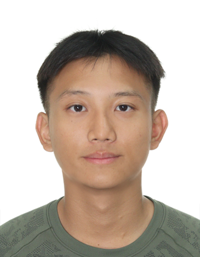
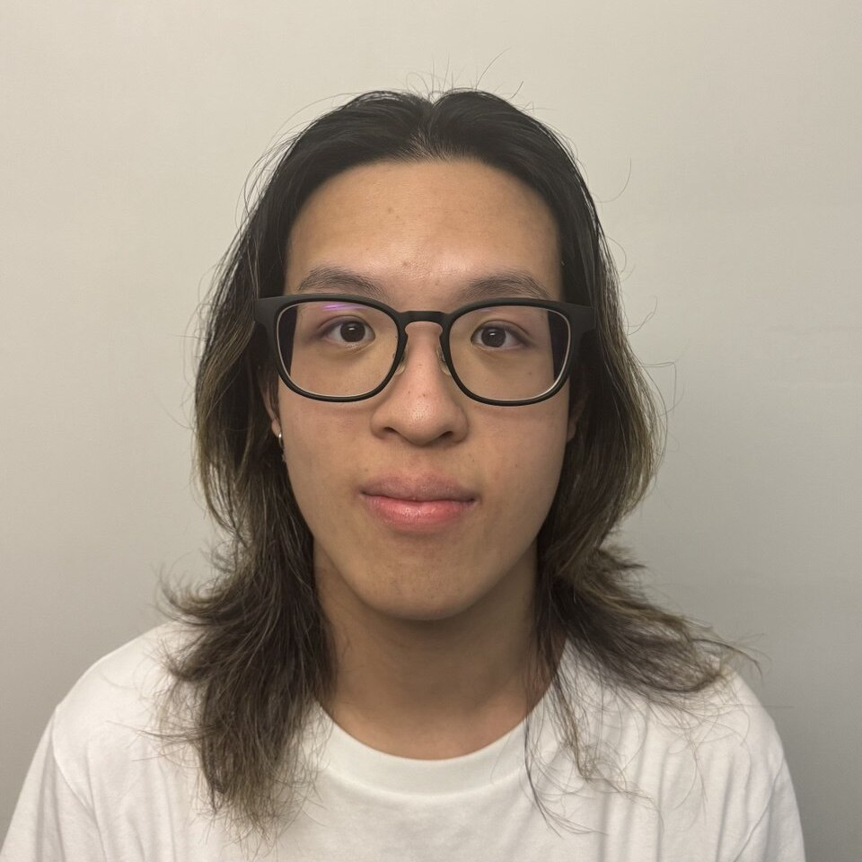

# About Us

We are a team based in the [School of Computing, National University of Singapore](http://www.comp.nus.edu.sg).

You can reach us at the email `seer[at]comp.nus.edu.sg`

## Project team

### Kevin

[[github](https://github.com/Kevin-129)]

* Role: Student

### Jane Doe

[[github](http://github.com/johndoe)]
[[portfolio](team/johndoe.md)]

* Role: Team Lead
* Responsibilities: UI

### Tan Shao Hng Sherman

[[github](http://github.com/shermszz)]

* Role: Deliverables and deadline
* Responsibilities: Ensure project deliverables are done on time and in the right format.

### Jean Doe

[[github](http://github.com/johndoe)]
[[portfolio](team/johndoe.md)]

* Role: Developer
* Responsibilities: Dev Ops + Threading

### Joel Wong

[[github](http://github.com/xHomeh)]

* Role: Testing
* Responsibilities: Ensures the testing of the project is done properly and on time.
