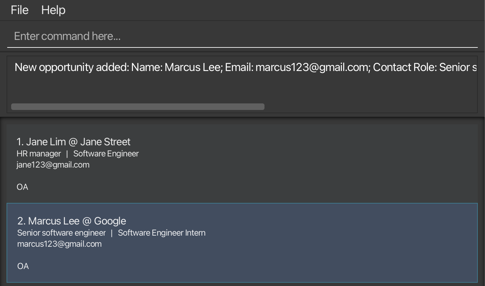
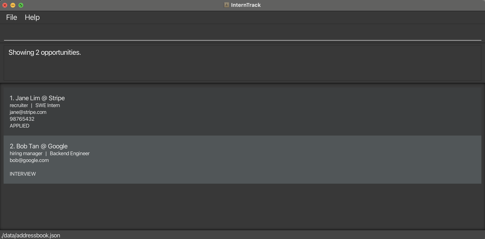
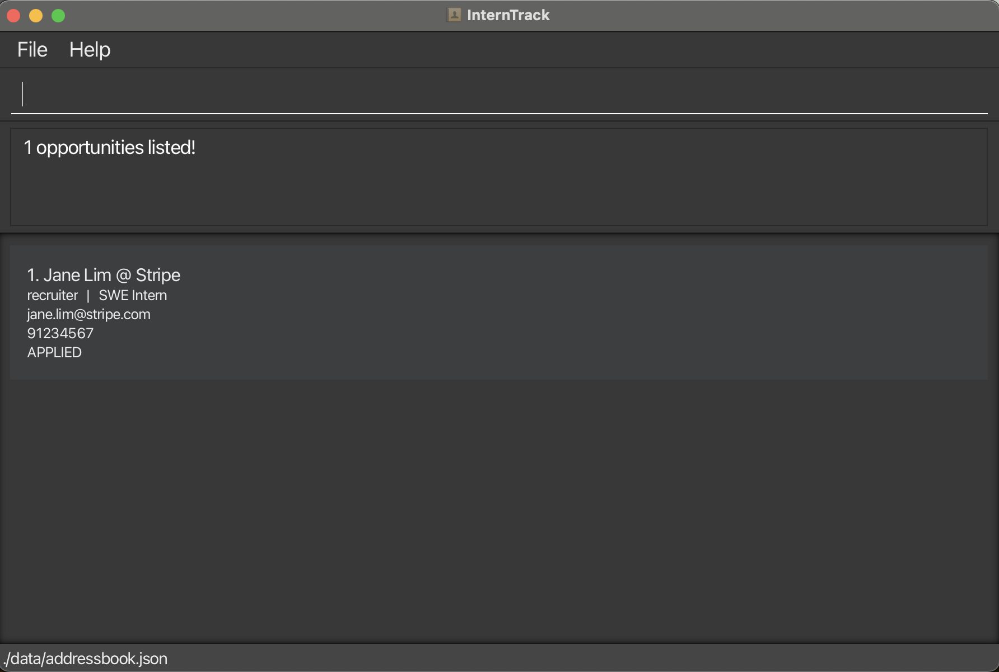
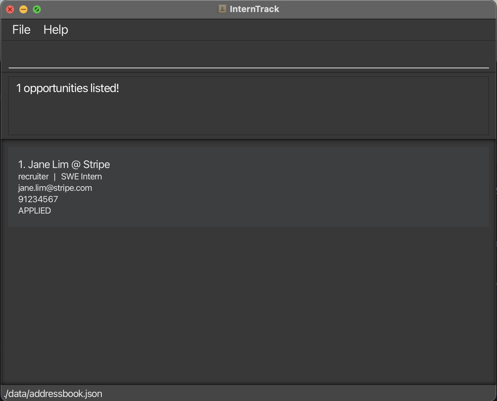
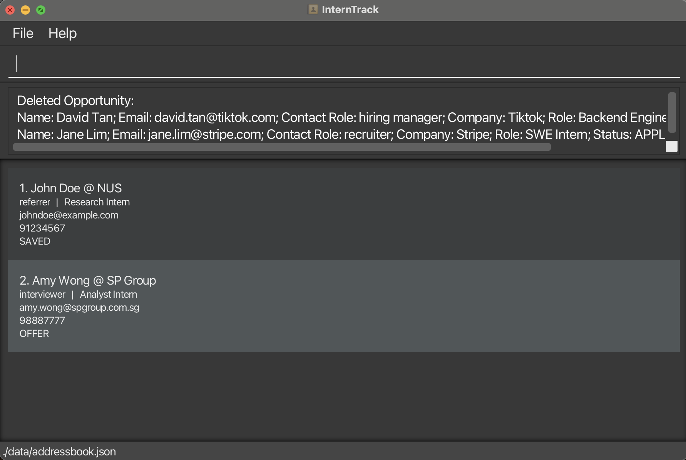
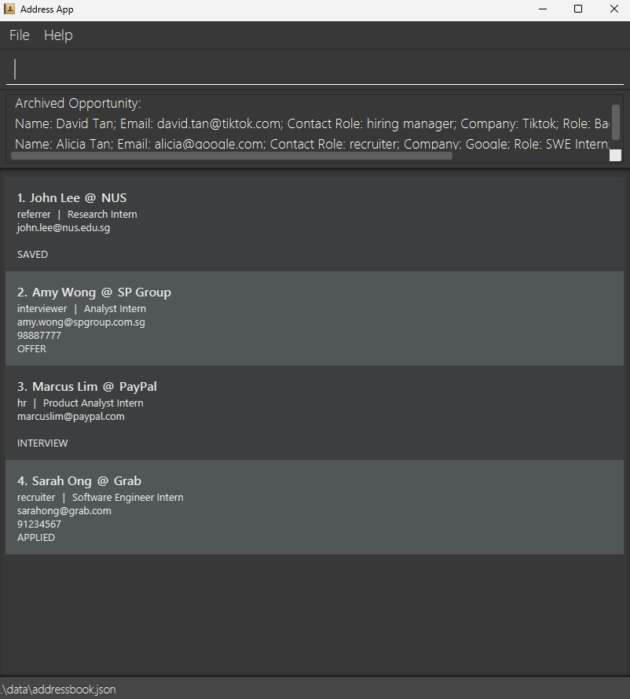
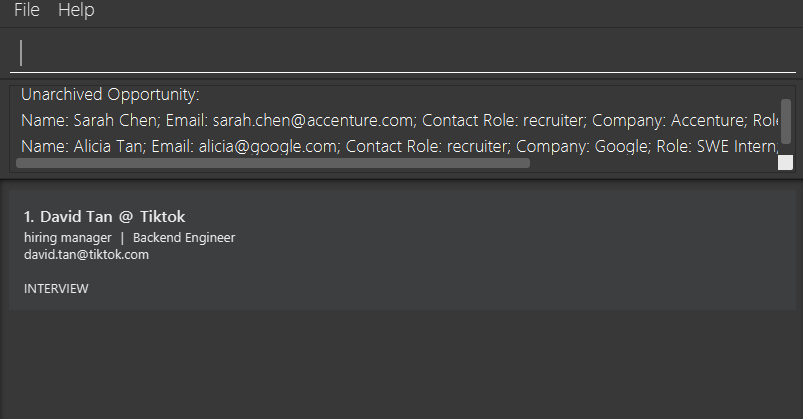
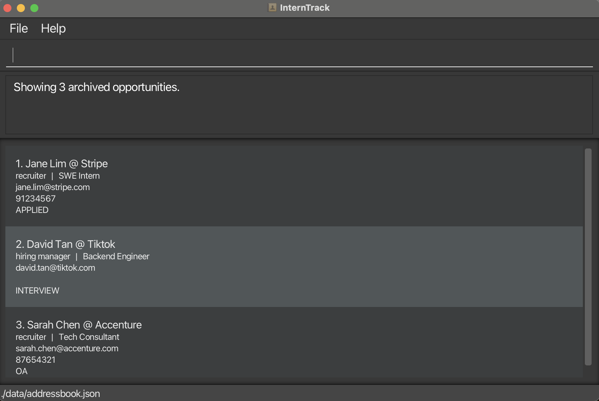
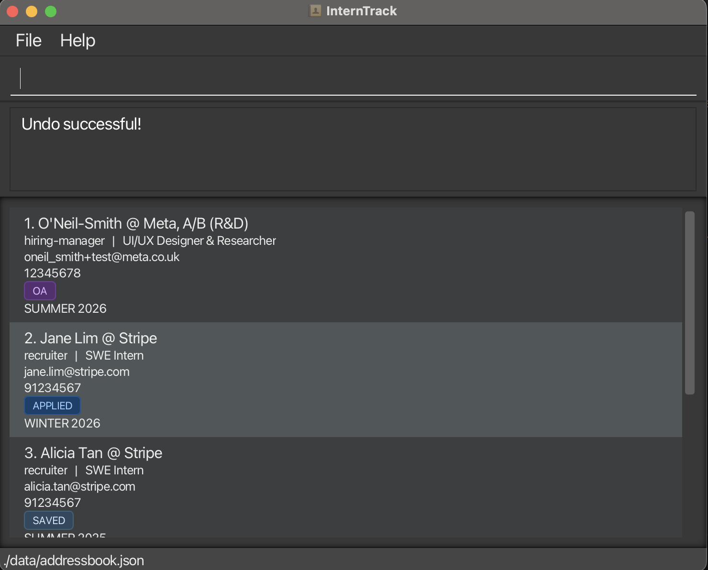
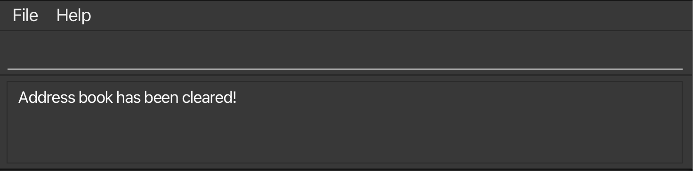

# InternTrack User Guide

InternTrack is a **desktop app for managing application-related contacts**, optimized for use via a **Command Line Interface** (CLI) while still providing the benefits of a Graphical User Interface (GUI). It is designed for fast-typing undergraduates who are applying to multiple internships and need a lightweight way to capture, update, and retrieve contact details together with the relevant opportunity context more efficiently than traditional GUI apps.

<!-- * Table of Contents -->
<page-nav-print />

--------------------------------------------------------------------------------------------------------------------

## Quick start

1. Ensure you have Java `17` or above installed in your Computer. 
   **Mac users:** Ensure you have the precise JDK version prescribed [here](https://se-education.org/guides/tutorials/javaInstallationMac.html).

1. Download the latest `.jar` file from [here](https://github.com/AY2526S2-CS2103T-W13-2/tp/releases/).

1. Copy the file to the folder you want to use as the _home folder_ for your InternTrack.

1. Open a command terminal, `cd` into the folder you put the jar file in, and use the `java -jar addressbook.jar` command to run the application. 
   A GUI similar to the below should appear in a few seconds. Note how the app contains some sample data. 
   

1. Type the command in the command box and press Enter to execute it. e.g. typing **`help`** and pressing Enter will open the help window. 
   Some example commands you can try:

   * `list` : Lists all tracked contacts.

   * `add n/Jane Lim e/jane@stripe.com cr/recruiter c/Stripe r/SWE Intern s/APPLIED cy/SUMMER 2026` : Adds a contact Jane Lim (recruiter at Stripe) linked to your SWE Intern application for the Summer 2026 cycle.

   * `delete 3` : Deletes the 3rd contact shown in the current list.

   * `clear` : Deletes all tracked opportunity contacts, including archived ones.

   * `exit` : Exits the app.

1. Refer to the [Features](#features) below for details of each command.

--------------------------------------------------------------------------------------------------------------------

## Features

<box type="info" seamless>

**Notes about the command format:** 

* Words in `UPPER_CASE` are the parameters to be supplied by the user. 
  e.g. in `add n/NAME e/EMAIL cr/CONTACT_ROLE c/COMPANY r/ROLE s/STATUS cy/CYCLE`, `NAME`, `EMAIL`, `CONTACT_ROLE`, `COMPANY`, `ROLE`, `STATUS` and `CYCLE` are parameters which can be used as `add n/Alicia Tan e/alicia.tan@stripe.com cr/recruiter c/Stripe r/SWE Intern s/SAVED cy/SUMMER 2026`.

* Items in square brackets are optional. 
  e.g `n/NAME e/EMAIL cr/CONTACT_ROLE c/COMPANY r/ROLE s/STATUS cy/CYCLE [p/PHONE_NUMBER]` can be used as `n/Alicia Tan e/alicia.tan@stripe.com cr/recruiter c/Stripe r/SWE Intern s/SAVED cy/SUMMER 2026 p/91234567` or as `n/Alicia Tan e/alicia.tan@stripe.com cr/recruiter c/Stripe r/SWE Intern s/SAVED cy/SUMMER 2026`.

* Items with `…`​ after them can be used multiple times including zero times. 
  e.g. `INDEX [MORE_INDICES]...` can be used as ` ` (i.e. 0 times), `1`, `1 2`, `1 2 3` etc.

* Parameters can be in any order. 
  e.g. if the command specifies `n/Alicia Tan e/alicia.tan@stripe.com cr/recruiter c/Stripe r/SWE Intern s/SAVED cy/SUMMER 2026 p/91234567`, `e/alicia.tan@stripe.com n/Alicia Tan c/Stripe r/SWE Intern s/SAVED cy/SUMMER 2026 cr/recruiter p/91234567` is also acceptable.

* Extraneous parameters for commands that do not take in parameters (such as `undo`, `help`, `exit` and `clear`) will be ignored. 
  e.g. if the command specifies `help 123`, it will be interpreted as `help`. 

* If you are using a PDF version of this document, be careful when copying and pasting commands that span multiple lines as space characters surrounding line-breaks may be omitted when copied over to the application.
</box>

### Viewing help : `help`

Shows a message explaining how to access the help page.

Format: `help`

### Adding an opportunity contact: `add`

Adds an opportunity contact to InternTrack.

Format: `add n/NAME e/EMAIL cr/CONTACT_ROLE c/COMPANY r/ROLE s/STATUS cy/CYCLE [p/PHONE]​`

* `p/PHONE` is optional and can be omitted if the contact's phone number is not available.
* `STATUS` must be one of: `SAVED`, `APPLIED`, `OA`, `INTERVIEW`, `OFFER`, `REJECTED`, `WITHDRAWN`.
* `cy/CYCLE` is mandatory and must be one of (SUMMER, WINTER, S1, S2) followed by a space and a 4-digit year (e.g. SUMMER 2025).
* Archived records still count toward duplicate detection. If you try to add a record with the same Email, Company, Role, and Cycle as an archived entry, the add will be rejected. Use `unarchive` to restore the existing entry instead.

Examples:
* `add n/Jane Lim e/jane@stripe.com cr/recruiter c/Stripe r/SWE Intern s/APPLIED cy/SUMMER 2026 p/98765432`
* `add n/Bob Tan e/bob@google.com cr/hiring manager c/Google r/Backend Engineer s/INTERVIEW cy/WINTER 2025`

### Listing all opportunities : `list`

Shows all tracked unarchived opportunities.

Format: `list`

### Editing an opportunity contact: `edit`

Edits an existing opportunity contact in InternTrack.

Format: `edit INDEX [n/NAME] [e/EMAIL] [cr/CONTACT_ROLE] [c/COMPANY] [r/ROLE] [s/STATUS] [cy/CYCLE] [p/PHONE]​`

* Edits the opportunity contact at the specified `INDEX`. The index refers to the index number shown in the displayed opportunity contact list. The index **must be a positive integer** 1, 2, 3, …​
* At least one of the optional fields must be provided.
* Existing values will be updated to the input values.
* An edit that results in the same Email, Company, Role, and Cycle as an existing record in the tracker will be rejected.
* To clear an existing phone number, use `p/` with no value (e.g. `edit 1 p/`).

Examples:
*  `edit 1 p/91234567 e/johndoe@example.com` Edits the phone number and email address of the 1st opportunity contact to be `91234567` and `johndoe@example.com` respectively.
*  `edit 1 p/` Clears the phone number of the 1st opportunity contact.

### Locating opportunity contacts: `find`

Finds opportunity contacts whose names contain all of the given keywords, optionally filtered by company.
By default, `find` searches unarchived opportunities. Add `-a` immediately after `find` to search archived opportunities instead.

Format: `find [-a] [NAME_KEYWORD [MORE_NAME_KEYWORDS]...] [c/COMPANY_KEYWORD [MORE_COMPANY_KEYWORDS]...]`

* The search is case-insensitive. e.g. `jan` will match `Jane`
* Partial words are matched for both name and company. e.g. `find jan c/Tik` matches `Jane @ TikTok`
* If name keywords are provided, only contacts whose names match all given name keywords are returned.
* If a company filter is provided, only contacts whose company matches all given company keywords are returned.
* If both name keywords and a company filter are provided, both conditions must match.
* You can search by company only by leaving the name blank. e.g. `find c/Visa`
* Use `-a` immediately after `find` to search archived opportunities instead of the active list. e.g. `find -a jan`
* `find`, `find c/`, `find -a`, and `find -a c/` are invalid because at least one search term must be provided.

Examples:
* `find Jane` returns contacts whose names contain `Jane`
* `find -a jan` returns archived contacts whose names contain `jan`
* `find jan c/Tik` returns contacts whose names contain `jan` and whose company contains `Tik`
* `find -a c/Visa` returns archived contacts whose company contains `Visa`
* `find c/Visa` returns all contacts whose company contains `Visa`
* `find jane lim` returns contacts whose names contain both `jane` and `lim`

### Deleting an opportunity contact : `delete`

Deletes one or more specified opportunity contacts from InternTrack.

Format: `delete INDEX [MORE_INDICES]...`

* Deletes the opportunity contact(s) at the specified `INDEX`es.
* The index refers to the index number shown in the displayed opportunity contact list.
* The index **must be a positive integer** 1, 2, 3, …​
* If multiple indices are provided, they must be separated by spaces.
* Duplicate indices are not allowed.

Examples:
* `list` followed by `delete 2` deletes the 2nd opportunity contact in the tracker.
* `find c/Stripe` followed by `delete 1 2 3` deletes the 1st, 2nd, and 3rd opportunity contacts in the displayed results.

### Archiving an opportunity contact : `archive`

Archives one or more specified opportunity contacts in InternTrack.

Format:
* `archive INDEX [MORE_INDICES]...`
* `archive cycle CYCLE`

* Archives the opportunity contact(s) at the specified `INDEX`es.
* The index refers to the index number shown in the displayed unarchived / active opportunity contact list.
* The index **must be a positive integer** 1, 2, 3, …​
* If multiple indices are provided, they must be separated by spaces.
* Duplicate indices are not allowed.
* `archive cycle CYCLE` archives all active opportunity contacts with the specified cycle, regardless of the current view.
* A cycle must be one of (SUMMER, WINTER, S1, S2) followed by a space and a 4-digit year (e.g. SUMMER 2025).

Examples:
* `list` followed by `archive 2` archives the 2nd opportunity contact in the tracker.
* `list` followed by `archive 1 2 3` archives the 1st, 2nd, and 3rd unarchived opportunity contacts in the displayed results.
* `archive cycle S1 2026` archives all active opportunity contacts for `S1 2026`.
* `archive cycle S2 2026` archives all active opportunity contacts for `S2 2026`.

### Unarchiving an opportunity contact : `unarchive`

Unarchives one or more specified opportunity contacts in InternTrack.

Format: `unarchive INDEX [MORE_INDICES]...`

* Unarchives the opportunity contact(s) at the specified `INDEX`es.
* The index refers to the index number shown in the displayed archived opportunity contact list.
* This works for both `list archive` results and archived search results from `find -a ...`.
* The index **must be a positive integer** 1, 2, 3, …​
* If multiple indices are provided, they must be separated by spaces.
* Duplicate indices are not allowed.

Examples:
* `list archive` followed by `unarchive 2` unarchives the 2nd archived opportunity contact in the tracker.
* `list archive` followed by `unarchive 1 2 3` unarchives the 1st, 2nd, and 3rd archived opportunity contacts in the displayed results.

### Listing all archived opportunities : `list archive`

Shows all opportunities that have been archived. Use this command to see the indices of archived entries before running `unarchive`.

Format: `list archive`

### Undoing a command: `undo`

Reverts the tracker to its state before the most recent **mutating** command (e.g., `add`, `delete`, `edit`, `clear`, `archive`, `unarchive`) was executed.

Format: `undo`

**Caution:**
* The `undo` command only works if there is a previous state to restore. If you have just launched the app or have already undone all recent commands, executing `undo` will fail with a "No more commands to undo!" error.
* Read-only commands (like `list` or `find`) do not modify the tracker's state and cannot be undone.

### Clearing all entries : `clear`

Clears **all** opportunity contacts from InternTrack, including archived ones, giving you a blank slate.

<box type="warning" seamless>

**Caution:** `clear` permanently removes all opportunity contacts, including archived ones. This action cannot be undone.

</box>

Format: `clear`

### Exiting the program : `exit`

Exits the program.

Format: `exit`

### Saving the data

InternTrack data are saved in the hard disk automatically after any command that changes the data. There is no need to save manually.

### Editing the data file

InternTrack data are saved automatically as a JSON file `[JAR file location]/data/addressbook.json`. Advanced users are welcome to update data directly by editing that data file.

<box type="warning" seamless>

**Caution:**
If your changes to the data file makes its format invalid, InternTrack will discard all data and start with an empty data file at the next run.  Hence, it is recommended to take a backup of the file before editing it. 
Furthermore, certain edits can cause the InternTrack to behave in unexpected ways (e.g., if a value entered is outside the acceptable range). Therefore, edit the data file only if you are confident that you can update it correctly.
</box>

--------------------------------------------------------------------------------------------------------------------

## FAQ

**Q: How do I transfer my data to another computer?**
**A:** Install InternTrack on the other computer, then replace the data file created there with the data file from your current computer.

**Q: Where does InternTrack store my data?**
**A:** InternTrack stores its data in `data/addressbook.json`, where the `data` folder is created in the same directory as the application JAR file. For example, if the JAR file is placed in Desktop, the data file will be stored in `Desktop/data/addressbook.json`.

**Q: Are my changes saved automatically?**
**A:** Yes. InternTrack automatically saves after every state-changing operation(e.g., add, delete, edit, archive, unarchive).

**Q: Does InternTrack need internet access to work?**
**A:** No. InternTrack is designed to support all core functions fully offline.

**Q: Why is my command rejected due to an invalid index?**
**A:** The specified index does not match any record in the currently displayed list. Use the index shown in the latest displayed list.

**Q: Can an archived record be restored?**
**A:** Yes. First use the `list archive` command to view archived opportunity contacts, then use the `unarchive` command to restore the selected archived opportunity record to the active list.

**Q: What happens if the data file cannot be read or written?**
**A:** InternTrack will not crash and will inform you that the storage operation has failed.

**Q: Do I need to use the GUI to access core features?**
**A:** No. All core features can be completed using keyboard-only input.

--------------------------------------------------------------------------------------------------------------------

## Known issues

1. **When using multiple screens**, if you move the application to a secondary screen, and later switch to using only the primary screen, the GUI will open off-screen. The remedy is to delete the `preferences.json` file created by the application before running the application again.
2. **If you minimize the Help Window** and then run the `help` command (or use the `Help` menu, or the keyboard shortcut `F1`) again, the original Help Window will remain minimized, and no new Help Window will appear. The remedy is to manually restore the minimized Help Window.

--------------------------------------------------------------------------------------------------------------------

## Command summary

Action     | Format, Examples
-----------|----------------------------------------------------------------------------------------------------------------------------------------------------------------------
**Add**    | `add n/NAME e/EMAIL cr/CONTACT_ROLE c/COMPANY r/ROLE s/STATUS cy/CYCLE [p/PHONE]​`   e.g., `add n/Jane Lim e/jane@stripe.com cr/recruiter c/Stripe r/SWE Intern s/APPLIED cy/SUMMER 2026 p/98765432`
**Edit**   | `edit INDEX [n/NAME] [e/EMAIL] [cr/CONTACT_ROLE] [c/COMPANY] [r/ROLE] [s/STATUS] [cy/CYCLE] [p/PHONE]​`  e.g.,`edit 1 p/91234567 e/johndoe@example.com`
**List**   | `list`
**Find**   | `find [-a] [NAME_KEYWORD [MORE_NAME_KEYWORDS]...] [c/COMPANY_KEYWORD [MORE_COMPANY_KEYWORDS]...]`  e.g., `find -a Jane c/Stripe`
**Delete** | `delete INDEX [MORE_INDICES]...`  e.g., `delete 1 2 3`
**Archive** | `archive INDEX [MORE_INDICES]...` or `archive cycle CYCLE`  e.g., `archive 1 2 3` or `archive cycle SUMMER 2026`
**Unarchive** | `unarchive INDEX [MORE_INDICES]...`  e.g., `unarchive 1 2 3`
**List Archive** | `list archive`
**Undo** | `undo` |
**Clear**  | `clear`
**Help**   | `help`
**Exit**   | `exit`
