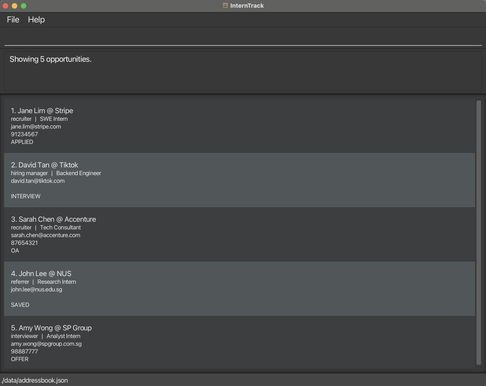

# InternTrack User Guide

InternTrack is a **desktop app for managing application-related contacts**, optimized for use via a **Command Line Interface** (CLI) while still providing the benefits of a Graphical User Interface (GUI). It is designed for fast-typing undergraduates who are applying to multiple internships and need a lightweight way to capture, update, and retrieve contact details together with the relevant opportunity context more efficiently than traditional GUI apps.

<!-- * Table of Contents -->
<page-nav-print />

--------------------------------------------------------------------------------------------------------------------

## Quick start

1. Ensure you have Java `17` or above installed in your Computer. 
   **Mac users:** Ensure you have the precise JDK version prescribed [here](https://se-education.org/guides/tutorials/javaInstallationMac.html).

1. Download the latest `.jar` file from [here](https://github.com/se-edu/addressbook-level3/releases).

1. Copy the file to the folder you want to use as the _home folder_ for your AddressBook.

1. Open a command terminal, `cd` into the folder you put the jar file in, and use the `java -jar addressbook.jar` command to run the application. 
   A GUI similar to the below should appear in a few seconds. Note how the app contains some sample data. 
   

1. Type the command in the command box and press Enter to execute it. e.g. typing **`help`** and pressing Enter will open the help window. 
   Some example commands you can try:

   * `list` : Lists all tracked contacts.

   * `add n/Jane Lim e/jane@stripe.com cr/recruiter c/Stripe r/SWE Intern s/APPLIED` : Adds a contact Jane Lim (recruiter at Stripe) linked to your SWE Intern application.

   * `delete 3` : Deletes the 3rd contact shown in the current list.

   * `clear` : Deletes all tracked contacts.

   * `exit` : Exits the app.

1. Refer to the [Features](#features) below for details of each command.

--------------------------------------------------------------------------------------------------------------------

## Features

<box type="info" seamless>

**Notes about the command format:** 

* Words in `UPPER_CASE` are the parameters to be supplied by the user. 
  e.g. in `add n/NAME e/EMAIL cr/CONTACT_ROLE c/COMPANY r/ROLE s/STATUS`, `NAME`, `EMAIl`, `CONTACT_ROLE`, `COMPANY`, `ROLE`, and `STATUS` are parameters which can be used as `add n/Alicia Tan e/alicia.tan@stripe.com cr/recruiter c/Stripe r/SWE Intern s/SAVED`.

* Items in square brackets are optional. 
  e.g `n/NAME e/EMAIL cr/CONTACT_ROLE c/COMPANY r/ROLE s/STATUS [p/PHONE_NUMBER]` can be used as `n/Alicia Tan e/alicia.tan@stripe.com cr/recruiter c/Stripe r/SWE Intern s/SAVED p/91234567` or as `n/Alicia Tan e/alicia.tan@stripe.com cr/recruiter c/Stripe r/SWE Intern s/SAVED`.

* Items with `…`​ after them can be used multiple times including zero times. 
  e.g. `INDEX [MORE_INDICES]...` can be used as ` ` (i.e. 0 times), `1`, `1 2`, `1 2 3` etc.

* Parameters can be in any order. 
  e.g. if the command specifies `n/Alicia Tan e/alicia.tan@stripe.com cr/recruiter c/Stripe r/SWE Intern s/SAVED p/91234567`, `e/alicia.tan@stripe.com n/Alicia Tan c/Stripe r/SWE Intern s/SAVED cr/recruiter p/91234567` is also acceptable.

* Extraneous parameters for commands that do not take in parameters (such as `help`, `exit` and `clear`) will be ignored. 
  e.g. if the command specifies `help 123`, it will be interpreted as `help`. 
  Note: `list` does **not** accept extra parameters — `list 3` is an error.

* If you are using a PDF version of this document, be careful when copying and pasting commands that span multiple lines as space characters surrounding line-breaks may be omitted when copied over to the application.
</box>

### Viewing help : `help`

Shows a message explaining how to access the help page.

Format: `help`

### Adding an opportunity contact: `add`

Adds an opportunity contact to InternTrack.

Format: `add n/NAME e/EMAIL cr/CONTACT_ROLE c/COMPANY r/ROLE s/STATUS [p/PHONE]​`

Examples:
* `add n/Jane Lim e/jane@stripe.com cr/recruiter c/Stripe r/SWE Intern s/APPLIED p/98765432`
* `add n/Bob Tan e/bob@google.com cr/hiring manager c/Google r/Backend Engineer s/INTERVIEW p/93257632`

### Listing all opportunities : `list`

Shows all tracked unarchived opportunities.

Format: `list`

### Listing all archived opportunities : `list archive`

Shows all opportunities that have been archived.

Format: `list archive`

* Use this command before `unarchive` so you can see the indices of archived entries.

### Editing an opportunity contact: `edit`

Edits an existing opportunity contact in InternTrack.

Format: `edit INDEX [n/NAME] [e/EMAIL] [cr/CONTACT_ROLE] [c/COMPANY] [r/ROLE] [s/STATUS] [p/PHONE]​`

* Edits the opportunity contact at the specified `INDEX`. The index refers to the index number shown in the displayed opportunity contact list. The index **must be a positive integer** 1, 2, 3, …​
* At least one of the optional fields must be provided.
* Existing values will be updated to the input values.

Examples:
*  `edit 1 p/91234567 e/johndoe@example.com` Edits the phone number and email address of the 1st opportunity contact to be `91234567` and `johndoe@example.com` respectively.

### Locating persons by name: `find`

Finds persons whose names contain any of the given keywords.

Format: `find KEYWORD [MORE_KEYWORDS]`

* The search is case-insensitive. e.g `hans` will match `Hans`
* The order of the keywords does not matter. e.g. `Hans Bo` will match `Bo Hans`
* Only the name is searched.
* Partial words are matched too. e.g. `Han` will match `Hans`
* Persons matching at least one keyword will be returned (i.e. `OR` search).
  e.g. `Hans Bo` will return `Hans Gruber`, `Bo Yang`

Examples:
* `find John` returns `john` and `John Doe`
* `find alex david` returns `Alex Yeoh`, `David Li` 
  

### Deleting an opportunity contact : `delete`

Deletes one or more specified opportunity contacts from InternTrack.

Format: `delete INDEX [MORE_INDICES]...`

* Deletes the opportunity contact(s) at the specified `INDEX`es.
* The index refers to the index number shown in the displayed opportunity contact list.
* The index **must be a positive integer** 1, 2, 3, …​
* If multiple indices are provided, they must be separated by spaces.

Examples:
* `list` followed by `delete 2` deletes the 2nd opportunity contact in the tracker.
* `find Stripe` followed by `delete 1 2 3` deletes the 1st, 2nd, and 3rd opportunity contacts in the displayed results.

### Clearing all entries : `clear`

Clears all opportunity contacts from InternTrack, giving you a blank slate.

Format: `clear`

### Exiting the program : `exit`

Exits the program.

Format: `exit`

### Saving the data

AddressBook data are saved in the hard disk automatically after any command that changes the data. There is no need to save manually.

### Editing the data file

AddressBook data are saved automatically as a JSON file `[JAR file location]/data/addressbook.json`. Advanced users are welcome to update data directly by editing that data file.

<box type="warning" seamless>

**Caution:**
If your changes to the data file makes its format invalid, AddressBook will discard all data and start with an empty data file at the next run.  Hence, it is recommended to take a backup of the file before editing it. 
Furthermore, certain edits can cause the AddressBook to behave in unexpected ways (e.g., if a value entered is outside the acceptable range). Therefore, edit the data file only if you are confident that you can update it correctly.
</box>

### Archiving data files `[coming in v2.0]`

_Details coming soon ..._

--------------------------------------------------------------------------------------------------------------------

## FAQ

**Q**: How do I transfer my data to another Computer? 
**A**: Install the app in the other computer and overwrite the empty data file it creates with the file that contains the data of your previous AddressBook home folder.

--------------------------------------------------------------------------------------------------------------------

## Known issues

1. **When using multiple screens**, if you move the application to a secondary screen, and later switch to using only the primary screen, the GUI will open off-screen. The remedy is to delete the `preferences.json` file created by the application before running the application again.
2. **If you minimize the Help Window** and then run the `help` command (or use the `Help` menu, or the keyboard shortcut `F1`) again, the original Help Window will remain minimized, and no new Help Window will appear. The remedy is to manually restore the minimized Help Window.

--------------------------------------------------------------------------------------------------------------------

## Command summary

Action     | Format, Examples
-----------|----------------------------------------------------------------------------------------------------------------------------------------------------------------------
**Add**    | `add n/NAME e/EMAIL cr/CONTACT_ROLE c/COMPANY r/ROLE s/STATUS [p/PHONE]​`   e.g., `add n/Jane Lim e/jane@stripe.com cr/recruiter c/Stripe r/SWE Intern s/APPLIED p/98765432`
**Clear**  | `clear`
**Delete** | `delete INDEX [MORE_INDICES]...`  e.g., `delete 1 2 3`
**Edit**   | `edit INDEX [n/NAME] [e/EMAIL] [cr/CONTACT_ROLE] [c/COMPANY] [r/ROLE] [s/STATUS] [p/PHONE]​`  e.g.,`edit 1 p/91234567 e/johndoe@example.com`
**Find**   | `find KEYWORD [MORE_KEYWORDS]`  e.g., `find James Jake`
**List**   | `list`
**List Archive** | `list archive`
**Help**   | `help`
**Exit**   | `exit`
